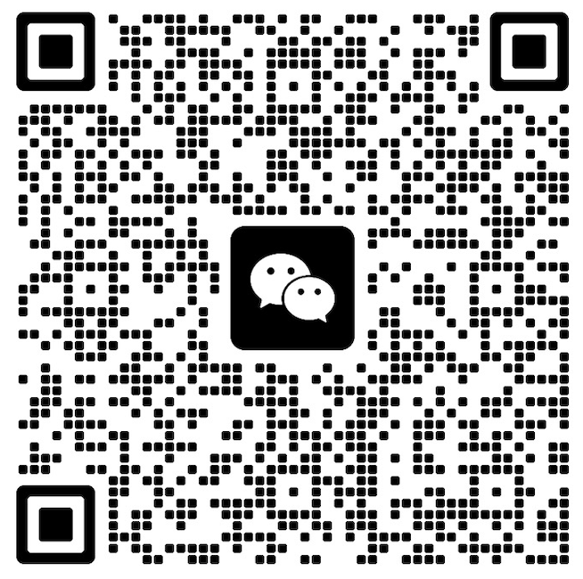
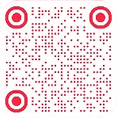

## 🌟 Who we are?

**Research AI+**, a non-profit community for young technologists—now 600+ members globally including AI researchers, engineers, devs and builders—across academia, big tech, and startups. 🚀

### Our Story

Research AI+ began in the most organic way. A small group came together: senior engineers from big tech, young professors from top universities, and even a few founders. We all shared the same drive— to test ideas, to build things, to make a real-world impact.

We noticed creators who could publish papers, deploy models, design products, and build prototypes—but had no good way to represent that multidimensional identity. When Bento.me shut down, it became clear: portfolios need to outlive companies.

### Our Belief

Connections matter most—especially in an era of rapid AI progress.

The best ideas emerge from:

- ✨ Motivation: People who build because they care
- 🌍 Diversity: Bridging disciplines, academia ↔ industry, borders
- 🤝 Connection: IRL experiences, casual chats that spark projects

### Our Vision

To break down walls:

- 🔬 Between disciplines 
- 🏢 Between academia and industry
- 🌏 Across borders and cultures
  
We'd love to invite you to join us and help shape what tech looks like in the AI era.

---

## 🌟 Join the Community

Open-Bento-Me is built and maintained by Research AI+. Not just users—contributors.

### 🤝 Connect With the Community

| Platform | Link | What You'll Find |
|----------|------|------------------|
| 💬 Wechat group |  | Join 600+ AI Researchers, Engineers, Research Founders and AI Builders. Daily discussions, news, collaborations, fellow connections, community private events. |
| 💡 Wechat subscription |  | Deep, source-driven reads on frontier AI, from top-conference papers to industry reports, with both researchers' and engineers' focus on real world impact. Also updates, events and community highlights. |
| 📚 Rednote |  | Deep, source-driven reads on frontier AI, from top-conference papers to industry reports, with both researchers' and engineers' focus on real world impact. Also updates, events and community highlights. |
| 📧 Newsletter (Substack) | [Subscribe](https://researchaiplusweekly.substack.com/) | Technical insights, community spotlights |
| 🎤 Interviews | Research: Side B (included in Wechat Subscription / Substack Newsletter / Redenote) | Interviews with emerging researchers, engineers and technical founders |
| 🌐 Events | [Event 1](https://x.com/Xander_zzzzz/status/1973298346531102755?s=20) [Event 2](https://mp.weixin.qq.com/s/9DpgcyvHe_Js1Lp8Am9saQ) | Salons, conference meetups, workshops, hackathons, talks, parties... More events recap on Wechat Subscription / Redenote |
| 🐦 X Founders | [@Xander_zzzzz](https://x.com/Xander_zzzzz) [@Liz_LizLi](https://x.com/Liz_LizLi) | Updates and community highlights; AI Research paper, Engineering; Engineering + Start-up + Open Source + AI Production |
